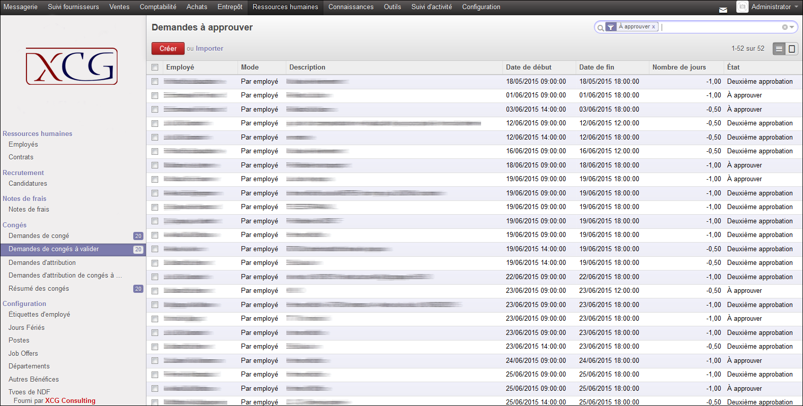
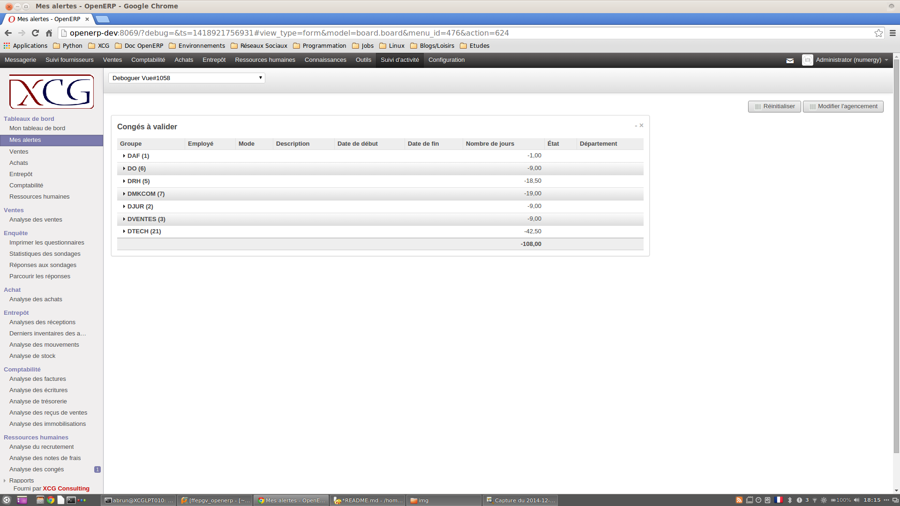

# README #

### Create your own Odoo/OpenERP notifications ###

* Create your own notifications based on the content of your activity.
* See your alerts in your Dasboard.
* Receive them automatically by email on regular intervals.
* Plan your own email frequency.

### Example Usage ###

* For Human Ressources Manager, It's important to be informed about the number of employees in holidays in order to planify the activity.

* First, create your alert:

* Then, see your alerts in Odoo/OpenERP:

* Finally, receive your own alerts by Email every morning.

